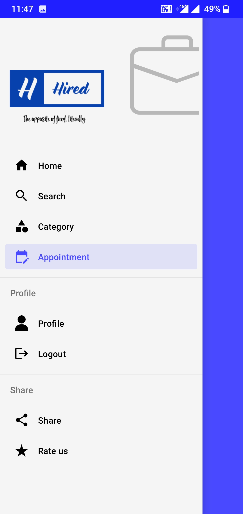

# HIRED

### Description

HIRED is an android app which acts as a platform for everyone who is in pursuit of a job/service or is providing one, irrespective of the type or magnitude of it. The purpose is to make seeking and providing services/jobs easier now than ever. It is the one-stop solution for everyone out there, making it easier for people to handle/ manage their appointments/schedules. It aims to provide a hassle-free solution for an otherwise overwhelming and tedious situation. With simple yet beautiful user-friendly UI design, the app makes it easier for all it’s target audiences.

### Features

- Post Services
- Search Services
- Service Categories
- Location based optimization
- Schedule Appointments
- Maintain User Profile
- User Authentication

### Tech Stack

- Android Studio IDE
- Java
- Firebase

### Screenshots

### Team Members

- [Abhishek T](https://github.com/AbhishekHari29)
- [Kailash S](https://github.com/kai-subramanian)
- [Harshitha Devineni](https://github.com/harshithadev)
